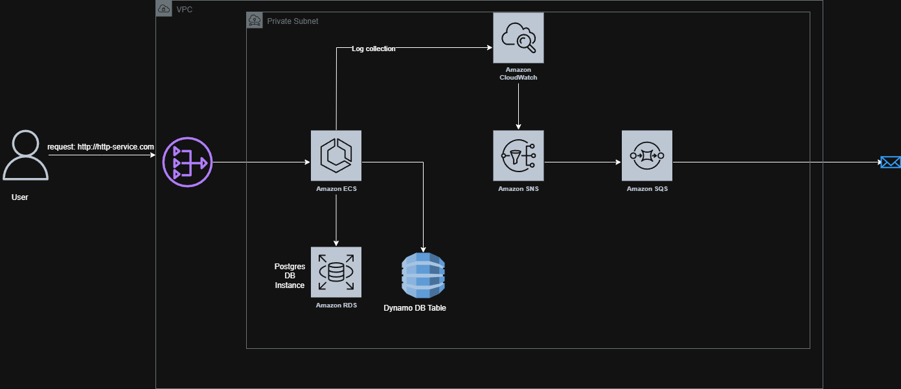

# HTTP Service VPC and ECS Setup

This repository uses Terraform to provision a VPC, ECS, Postgres database instance, and monitoring for the HTTP service on AWS. The Terraform will provision everything on the af-south-1 region.

Here is an overview architecture diagram:

Setup Instructions:

1. A bucket would need to be created on AWS, which will be used to store the Terraform state. 
2. AWS Credentials will need to be added to GitHub Secrets. This will be used for authenticating against the AWS environment to provision the infrastructure.
   Add the following to your secrets:
   AWS_REGION=af-south-1
   AWS_ACCESS_KEY_ID=XXXXXXXXX
   AWS_SECRET_ACCESS_KEY=XXXXXXX
3. Once the above is added, you are good to go.

The Terraform Github Action has the following stages:
 - Terraform Init (initialization step for Terraform)
 - Terraform Validate (Validates the syntax of the Terraform files)
 - Terraform Apply ( with manual approval required for safeguard)

The idea behind this design is to provision infrastructure to host a simple web app using ECS Fargate.

Private Subnet over a Public Subnet:
  - I have chosen to use only a private subnet with this setup because private subnet resources (e.g. ECS, RDS) to access the internet securely without being exposed to inbound traffic. Since in this setup I have not included any Load balancers it keeps the setup simple and secure
  - RDS Instance - Databases are not publicly accessible, so using a Private Subnet limits the attack surface area. This is coupled with a strict security group that only allows communication between the RDS instance and ECS
